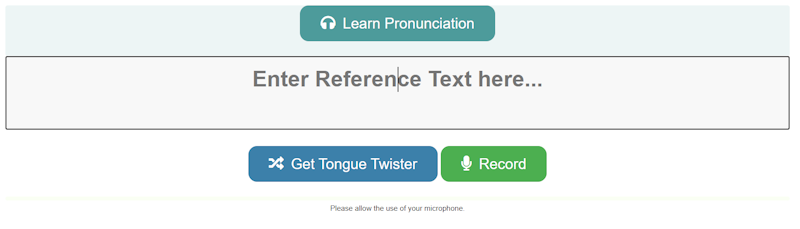
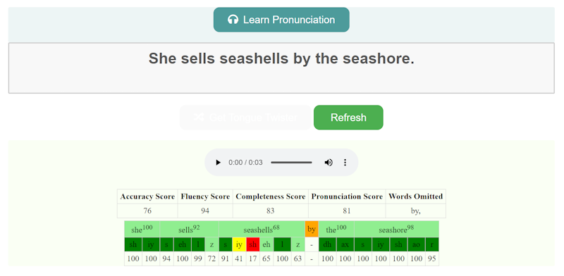
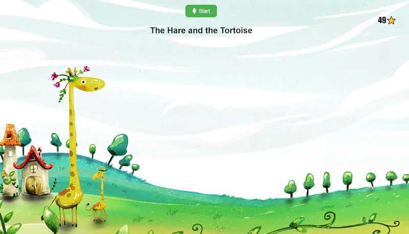

# Language Assessment tool

## Overview



This Pronunciation Assessment Browser sample code allows you to test the Azure Speech Service Pronunciation Assessment feature in your own browser. You can simply enter your reference text or choose a random Tongue Twister and click on the record button to test your voice.



You can also play the Learn Pronunciation button to hear back the correct Pronunciation for the text.

> Note: This is a Python Flask app and JavaScript based sample. It uses the en-US locale for Pronunciation Assessment and the en-GB LibbyNeural voice for TTS playback. You can change the TTS voice by editing the code.

Bonus - you can also test the read along experience on `http://localhost/readalong`



## Setup instructions

Instructions on how to run this sample:

To run on local (in terminal):

1. git clone the code
2. open the application.py file and enter your subscription_key and region values for your Azure Speech Service resource.
3. Download and extract the [Speech SDK for JavaScript](https://aka.ms/csspeech/jsbrowserpackage)  microsoft.cognitiveservices.speech.sdk.bundle.js file, and place it in a folder accessible to your HTML file - static folder

In cmd line, type the following commands:

```bash
pip install -r requirements.txt
set FLASK_APP=application.py
set FLASK_ENV=development
flask run
```

> Note:
> - For Ubuntu, change `set` to `export`
> `export FLASK_APP=application.py`
> `export FLASK_ENV=development`
> - For PowerShell, change `set` to `$env:`
> `$env:FLASK_APP = "application.py"`
> `$env:FLASK_ENV = "development"`
> `$env:'SPEECH_SERVICE_SUBSCRIPTION_KEY = "<>"`
> `$env:'SPEECH_SERVICE_REGION = "<>"`


## References

[Azure samples](https://github.com/Azure-Samples/Cognitive-Speech-TTS/tree/master/PronunciationAssessment)